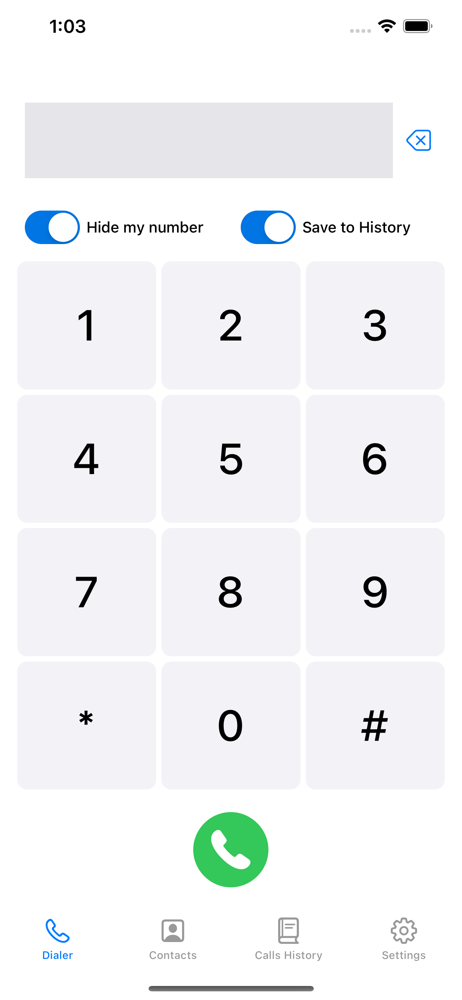
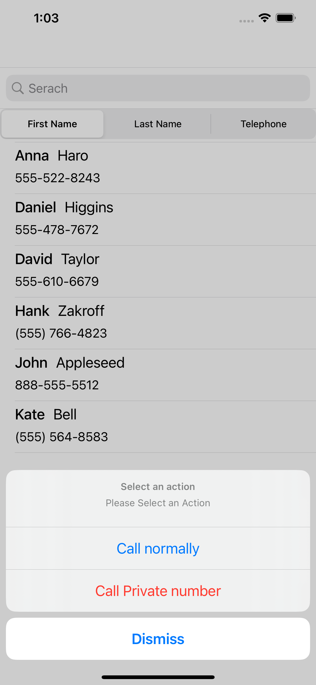
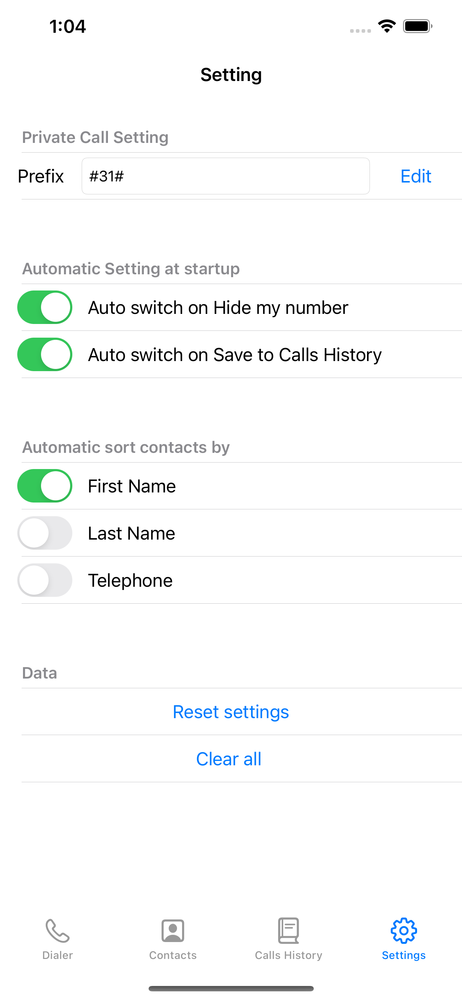
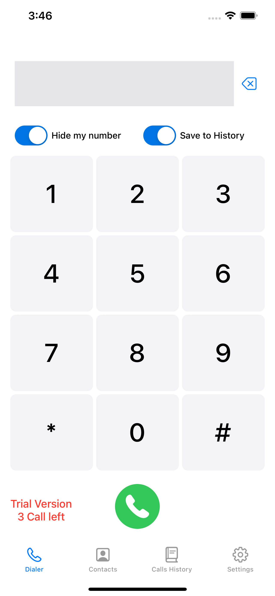
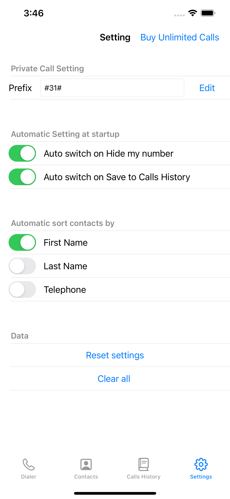

Pcaller
==========
An application for allowing you to dial privately and hide your number.
The application is used as a call dialer and the user has the option of dialing normally or hidden number without to need to change the settings on the phone or add the prefix.
The application allows dialing a hidden number from the contacts and also allows the user presence settings to change the prefix

## Important
This application is different from the app in App store. 
The application developed with storekit to embed In-App Purchase, to offer the user try a free trial version of the application  
The user can calling until 3 times free calls after which the access to call from the application will be blocked. 
If the user has not purchased unlimited package - even after deleting the application, the number of remaining call trials will be saved.
 
You can turn on the option Enable in app purchase by change the var enableInAppPurchase to true in the service class.
 
<b>Please do not run this application in simulator some features will not work for you.</b>

## Screenshots App Store Version
  

    &nbsp;&nbsp;
  &nbsp;&nbsp;
  &nbsp;&nbsp;

## Screenshots In-App Purchase Version
  

    &nbsp;&nbsp;
  &nbsp;&nbsp;
  &nbsp;&nbsp;

## Download From App Store
 

